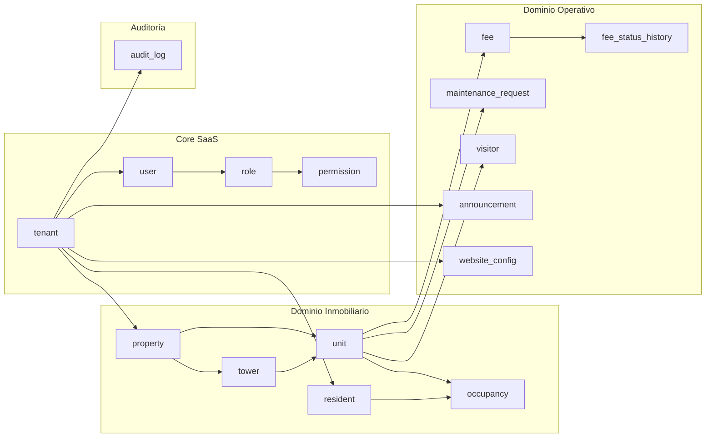
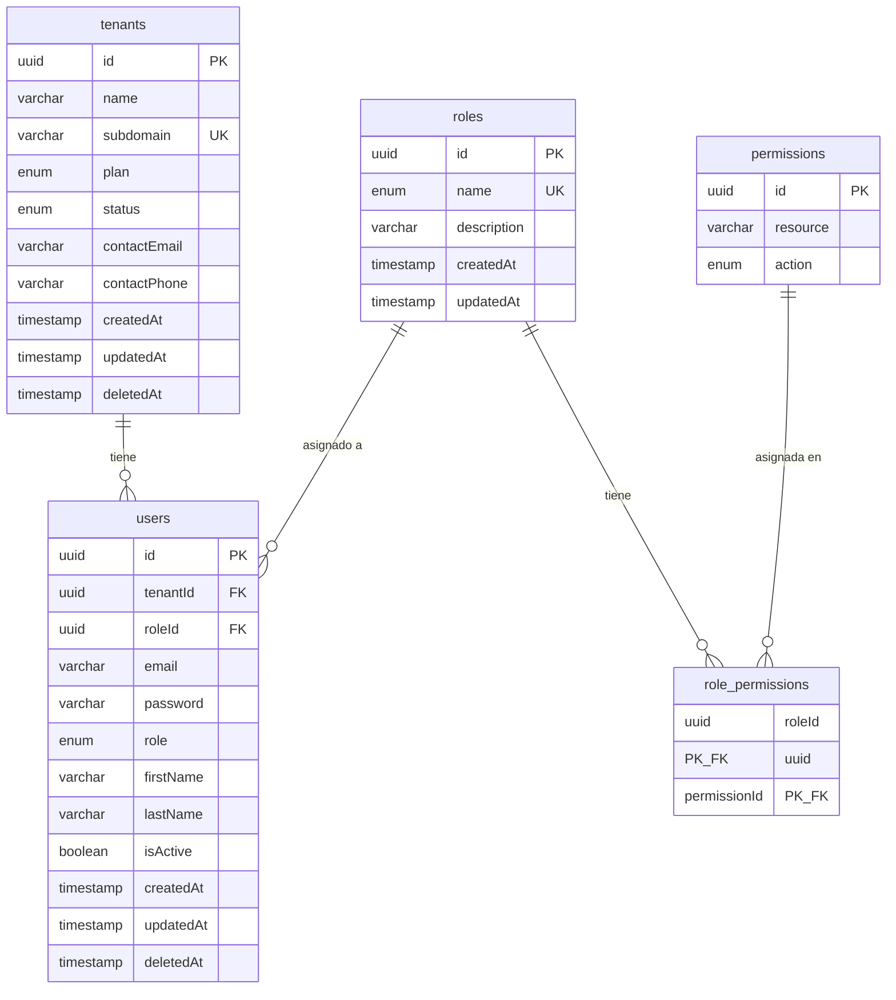
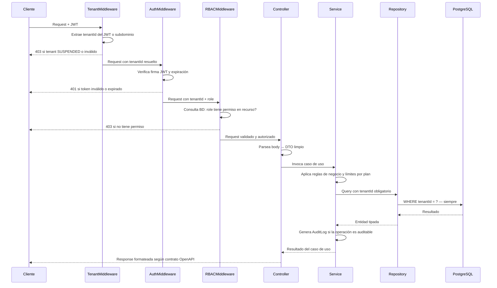

# DATABASE.md — Modelo de Datos del Sistema

> Este archivo es el contrato del modelo de datos. Cualquier agente de IA, IDE o colaborador debe leerlo antes de generar, modificar o revisar código que acceda a la base de datos. Todo lo aquí definido tiene carácter de decisión arquitectónica congelada para la v1.
>
> **Cadena de verdad:** `openapi.yaml` → `schema.prisma` → este documento.  
> Un cambio estructural debe reflejarse en los tres artefactos simultáneamente o no es válido.

---

## 1. Stack y Estrategia

| Decisión | Valor |
|----------|-------|
| Motor | PostgreSQL |
| ORM | Prisma |
| IDs | UUID v4 — `@default(uuid())` en todas las tablas |
| Timestamps | `createdAt` auto, `updatedAt` auto — en todas las tablas |
| Soft delete | `deletedAt TIMESTAMP NULLABLE` — donde aplica por regla de negocio |
| Multi-tenancy | Shared database — aislamiento por `tenantId` en cada tabla |
| Montos | `DECIMAL(12,2)` — nunca `FLOAT` para valores financieros |
| Enums | Definidos en Prisma y PostgreSQL — nunca strings libres para estados |

---

## 2. Regla de Seguridad Crítica — Multi-Tenancy

**`tenantId` NUNCA proviene del frontend, body, ni query params.**  
Siempre se extrae del JWT (campo `client_id`) o del subdominio resuelto por `TenantMiddleware`.

```
Sin tenantId válido → 403 inmediato
Ninguna query puede ejecutarse sin WHERE tenantId = ?
Una query sin filtro tenantId es una fuga de datos — es el error más grave del sistema
```

`tenantId` está presente en tablas intermedias (`towers`, `units`, `fees`, `visitors`, `maintenance_requests`) aunque sea inferible por JOIN. Es **desnormalización deliberada** para que cada Repository filtre directamente sin JOINs adicionales.

---

## 3. Dominios Funcionales

El sistema tiene **17 tablas** organizadas en 4 dominios:

| Dominio | Tablas |
|---------|--------|
| **Core SaaS** | `tenants`, `users`, `roles`, `permissions`, `role_permissions` |
| **Inmobiliario** | `properties`, `towers`, `units`, `residents`, `occupancies` |
| **Operativo** | `fees`, `fee_status_history`, `maintenance_requests`, `visitors`, `announcements`, `website_configs` |
| **Auditoría** | `audit_logs` |

---

## 4. Jerarquía Inmobiliaria

```
Tenant
 └── Property (1:N)
      ├── Tower (1:N, opcional)
      │    └── Unit (1:N)
      │         └── Occupancy (1:N historial) ←── Resident
      └── Unit (1:N directo, sin torre)
           └── Occupancy (1:N historial) ←── Resident
```

**Reglas de jerarquía — congeladas:**
- Una `Unit` pertenece a una `Property` directamente **O** a una `Tower`. Nunca a ambas.
- Una `Unit` no puede moverse entre `Properties` — `propertyId` es inmutable post-creación.
- Una `Property` pertenece a un único `Tenant`.
- Un `Resident` puede estar en múltiples `Units` a lo largo del tiempo — vía `Occupancy`.
- Solo una `Occupancy` activa por `Unit` simultáneamente (`endDate IS NULL` = activa).

---

## 5. Diagrama de Módulos y Dependencias



---

## 6. Diagrama ER — Core SaaS



---

## 7. Diagrama ER — Dominio Inmobiliario

```mermaid
erDiagram
    properties {
        uuid id PK
        uuid tenantId FK
        varchar name
        enum propertyType
        varchar address
        varchar description
        timestamp createdAt
        timestamp updatedAt
        timestamp deletedAt
    }
    towers {
        uuid id PK
        uuid tenantId
        uuid propertyId FK
        varchar name
        int floorsCount
        timestamp createdAt
        timestamp updatedAt
        timestamp deletedAt
    }
    units {
        uuid id PK
        uuid tenantId
        uuid propertyId FK
        uuid towerId FK_NULL
        varchar identifier
        enum unitType
        int floor
        enum status
        decimal monthlyFeeAmount
        timestamp createdAt
        timestamp updatedAt
        timestamp deletedAt
    }
    residents {
        uuid id PK
        uuid tenantId FK
        varchar firstName
        varchar lastName
        enum documentType
        varchar documentNumber
        varchar email
        varchar phone
        varchar emergencyContact
        timestamp createdAt
        timestamp updatedAt
        timestamp deletedAt
    }
    occupancies {
        uuid id PK
        uuid tenantId
        uuid unitId FK
        uuid residentId FK
        enum type
        date startDate
        date endDate
        varchar notes
        timestamp createdAt
        timestamp updatedAt
    }

    properties ||--o{ towers : "contiene"
    properties ||--o{ units : "contiene directamente"
    towers ||--o{ units : "contiene"
    units ||--o{ occupancies : "tiene historial"
    residents ||--o{ occupancies : "habita en"
```

---

## 8. Diagrama ER — Dominio Operativo

```mermaid
erDiagram
    fees {
        uuid id PK
        uuid tenantId
        uuid unitId FK
        enum type
        decimal amount
        varchar period
        enum status
        decimal paidAmount
        date dueDate
        varchar description
        timestamp createdAt
        timestamp updatedAt
    }
    fee_status_history {
        uuid id PK
        uuid feeId FK
        enum fromStatus
        enum toStatus
        decimal paidAmount
        varchar notes
        varchar changedBy
        timestamp changedAt
    }
    maintenance_requests {
        uuid id PK
        uuid tenantId
        uuid unitId FK
        varchar title
        varchar description
        enum status
        varchar assignedTo
        timestamp resolvedAt
        timestamp createdAt
        timestamp updatedAt
    }
    visitors {
        uuid id PK
        uuid tenantId
        uuid unitId FK
        varchar visitorName
        varchar documentNumber
        timestamp entryDate
        timestamp exitDate
        varchar notes
        varchar registeredBy
        timestamp createdAt
        timestamp updatedAt
    }
    announcements {
        uuid id PK
        uuid tenantId FK
        varchar title
        varchar body
        array targetRoles
        varchar createdBy
        timestamp createdAt
        timestamp updatedAt
        timestamp deletedAt
    }
    website_configs {
        uuid id PK
        uuid tenantId UK_FK
        varchar logoUrl
        varchar primaryColor
        varchar secondaryColor
        json sections
        timestamp createdAt
        timestamp updatedAt
    }

    fees ||--o{ fee_status_history : "registra cambios"
```

---

## 9. Catálogo de Entidades

### `tenants`
Raíz del sistema. Cada cliente SaaS es un tenant aislado.

| Campo | Tipo | Constraint | Notas |
|-------|------|------------|-------|
| `id` | UUID | PK | — |
| `name` | VARCHAR(100) | NOT NULL | Nombre del conjunto/empresa |
| `subdomain` | VARCHAR(50) | UNIQUE NOT NULL | URL del cliente: `elprado.app.com` |
| `plan` | ENUM TenantPlan | NOT NULL · DEFAULT BASIC | `BASIC \| PREMIUM \| ENTERPRISE` |
| `status` | ENUM TenantStatus | NOT NULL · DEFAULT ACTIVE | `ACTIVE \| SUSPENDED \| INACTIVE` |
| `contactEmail` | VARCHAR(255) | NULLABLE | — |
| `contactPhone` | VARCHAR(30) | NULLABLE | — |
| `createdAt` | TIMESTAMP | NOT NULL · auto | — |
| `updatedAt` | TIMESTAMP | NOT NULL · auto | — |
| `deletedAt` | TIMESTAMP | NULLABLE | Soft delete |

**Índices:** `(status)`  
**Límites por plan** validados en Service — nunca en BD: BASIC = 1 prop / 100 unidades / 5 usuarios · PREMIUM = múltiples / 500 / 15 · ENTERPRISE = sin límite

### `roles`
Roles base del sistema. Cargados por seed. No editables por clientes en v1.

| Campo | Tipo | Constraint | Notas |
|-------|------|------------|-------|
| `id` | UUID | PK | — |
| `name` | ENUM UserRole | UNIQUE NOT NULL | `SUPER_ADMIN \| ADMIN_TENANT \| ADMINISTRATIVA \| PORTERIA` |
| `description` | VARCHAR(255) | NULLABLE | — |
| `createdAt` | TIMESTAMP | NOT NULL · auto | — |
| `updatedAt` | TIMESTAMP | NOT NULL · auto | — |

### `permissions`
Acciones por recurso. Cargadas por seed.

| Campo | Tipo | Constraint | Notas |
|-------|------|------------|-------|
| `id` | UUID | PK | — |
| `resource` | VARCHAR(50) | NOT NULL | `properties`, `units`, `residents`… |
| `action` | ENUM PermissionAction | NOT NULL | `read \| create \| update \| delete` |

**Unique:** `(resource, action)`

### `role_permissions`
Tabla de unión RBAC — qué acciones puede realizar cada rol.

| Campo | Tipo | Constraint |
|-------|------|------------|
| `roleId` | UUID | PK · FK → `roles.id` |
| `permissionId` | UUID | PK · FK → `permissions.id` |

**PK compuesta:** `(roleId, permissionId)`

### `users`
Usuarios internos. Uno por tenant como mínimo (`ADMIN_TENANT` creado en onboarding).

| Campo | Tipo | Constraint | Notas |
|-------|------|------------|-------|
| `id` | UUID | PK | — |
| `tenantId` | UUID | FK → `tenants.id` NOT NULL | — |
| `roleId` | UUID | FK → `roles.id` NOT NULL | Para `GET /roles` con permisos reales |
| `email` | VARCHAR(255) | UNIQUE por tenant NOT NULL | — |
| `password` | VARCHAR(255) | NOT NULL | Hash bcrypt — **jamás exponer** |
| `role` | ENUM UserRole | NOT NULL | Denormalizado para JWT — evita JOIN por request |
| `firstName` | VARCHAR(50) | NULLABLE | — |
| `lastName` | VARCHAR(50) | NULLABLE | — |
| `isActive` | BOOLEAN | NOT NULL · DEFAULT true | Suspensión sin eliminar |
| `createdAt` | TIMESTAMP | NOT NULL · auto | — |
| `updatedAt` | TIMESTAMP | NOT NULL · auto | — |
| `deletedAt` | TIMESTAMP | NULLABLE | Soft delete |

**Unique:** `(tenantId, email)` — el mismo email puede existir en tenants distintos  
**Índices:** `(tenantId)`, `(tenantId, isActive)`  
**Nota:** `role` se denormaliza intencionalmente. El middleware lee el enum del JWT sin query. `roleId` existe para el módulo RBAC.

### `properties`
Inmueble raíz del tenant.

| Campo | Tipo | Constraint | Notas |
|-------|------|------------|-------|
| `id` | UUID | PK | — |
| `tenantId` | UUID | FK → `tenants.id` NOT NULL | — |
| `name` | VARCHAR(100) | NOT NULL | — |
| `propertyType` | ENUM PropertyType | NOT NULL | `CONJUNTO \| EDIFICIO \| TORRE \| CASA_INDEPENDIENTE` |
| `address` | VARCHAR(200) | NULLABLE | — |
| `description` | VARCHAR(500) | NULLABLE | — |
| `createdAt` | TIMESTAMP | NOT NULL · auto | — |
| `updatedAt` | TIMESTAMP | NOT NULL · auto | — |
| `deletedAt` | TIMESTAMP | NULLABLE | Bloqueado si tiene unidades activas |

**Índices:** `(tenantId)`, `(tenantId, deletedAt)`

### `towers`
Torres opcionales dentro de una propiedad.

| Campo | Tipo | Constraint | Notas |
|-------|------|------------|-------|
| `id` | UUID | PK | — |
| `tenantId` | UUID | NOT NULL | Desnormalizado para filtro directo |
| `propertyId` | UUID | FK → `properties.id` NOT NULL | — |
| `name` | VARCHAR(50) | NOT NULL | Ej: "Torre A" |
| `floorsCount` | INT | NULLABLE | — |
| `createdAt` | TIMESTAMP | NOT NULL · auto | — |
| `updatedAt` | TIMESTAMP | NOT NULL · auto | — |
| `deletedAt` | TIMESTAMP | NULLABLE | Bloqueado si tiene unidades activas |

**Índices:** `(tenantId)`, `(propertyId)`

### `units`
Unidad habitacional o comercial. Átomo del sistema inmobiliario.

| Campo | Tipo | Constraint | Notas |
|-------|------|------------|-------|
| `id` | UUID | PK | — |
| `tenantId` | UUID | NOT NULL | Desnormalizado para filtro directo |
| `propertyId` | UUID | FK → `properties.id` NOT NULL | Inmutable post-creación |
| `towerId` | UUID | FK → `towers.id` NULLABLE | `NULL` = sin torre (directo a propiedad) |
| `identifier` | VARCHAR(20) | NOT NULL | Ej: "Apto 101", "Local 3" |
| `unitType` | ENUM UnitType | NOT NULL | `APARTMENT \| HOUSE \| COMMERCIAL \| PARKING` |
| `floor` | INT | NULLABLE | — |
| `status` | ENUM UnitStatus | NOT NULL · DEFAULT AVAILABLE | `AVAILABLE \| OCCUPIED \| MAINTENANCE` |
| `monthlyFeeAmount` | DECIMAL(12,2) | NULLABLE | Monto base de cuota mensual |
| `createdAt` | TIMESTAMP | NOT NULL · auto | — |
| `updatedAt` | TIMESTAMP | NOT NULL · auto | — |
| `deletedAt` | TIMESTAMP | NULLABLE | Bloqueado si tiene occupancies o fees |

**Unique:** `(propertyId, identifier)` — identificador único dentro de la propiedad  
**Índices:** `(tenantId)`, `(tenantId, status)`, `(propertyId)`, `(towerId)`

### `residents`
Persona física asociada a unidades vía `Occupancy`.

| Campo | Tipo | Constraint | Notas |
|-------|------|------------|-------|
| `id` | UUID | PK | — |
| `tenantId` | UUID | FK → `tenants.id` NOT NULL | — |
| `firstName` | VARCHAR(50) | NOT NULL | — |
| `lastName` | VARCHAR(50) | NOT NULL | — |
| `documentType` | ENUM DocumentType | NOT NULL | `CC \| CE \| PASSPORT \| NIT` |
| `documentNumber` | VARCHAR(20) | NOT NULL | — |
| `email` | VARCHAR(255) | NULLABLE | Email personal — no de acceso al sistema |
| `phone` | VARCHAR(30) | NULLABLE | — |
| `emergencyContact` | VARCHAR(100) | NULLABLE | Texto libre |
| `createdAt` | TIMESTAMP | NOT NULL · auto | — |
| `updatedAt` | TIMESTAMP | NOT NULL · auto | — |
| `deletedAt` | TIMESTAMP | NULLABLE | Bloqueado si tiene occupancies históricas |

**Unique:** `(tenantId, documentNumber)` — un residente no puede duplicarse en el mismo tenant  
**Índices:** `(tenantId)`

### `occupancies`
Relación Residente↔Unidad con historial completo. **Registro inmutable.**

| Campo | Tipo | Constraint | Notas |
|-------|------|------------|-------|
| `id` | UUID | PK | — |
| `tenantId` | UUID | NOT NULL | Desnormalizado |
| `unitId` | UUID | FK → `units.id` NOT NULL | — |
| `residentId` | UUID | FK → `residents.id` NOT NULL | — |
| `type` | ENUM OccupancyType | NOT NULL | `OWNER \| TENANT` |
| `startDate` | DATE | NOT NULL | Fecha de inicio |
| `endDate` | DATE | NULLABLE | `NULL` = ocupación activa. Inmutable una vez registrado. |
| `notes` | VARCHAR(500) | NULLABLE | — |
| `createdAt` | TIMESTAMP | NOT NULL · auto | — |
| `updatedAt` | TIMESTAMP | NOT NULL · auto | — |

**Sin `deletedAt`** — el historial de ocupación es indestructible por diseño  
**Sin DELETE físico** — nunca se elimina, ni por soft delete  
**Índices:** `(tenantId)`, `(unitId)`, `(residentId)`, `(unitId, endDate)`  
**Regla:** Solo una occupancy con `endDate IS NULL` por `unitId` — validado en Service antes del INSERT

### `fees`
Cuota administrativa. Sin pasarela de pago.

| Campo | Tipo | Constraint | Notas |
|-------|------|------------|-------|
| `id` | UUID | PK | — |
| `tenantId` | UUID | NOT NULL | Desnormalizado |
| `unitId` | UUID | FK → `units.id` NOT NULL | — |
| `type` | ENUM FeeType | NOT NULL | `PERIODIC \| EXTRAORDINARY \| ADJUSTMENT` |
| `amount` | DECIMAL(12,2) | NOT NULL | Monto total |
| `period` | VARCHAR(7) | NOT NULL | Formato `YYYY-MM` |
| `status` | ENUM FeeStatus | NOT NULL · DEFAULT PENDING | `PENDING \| PAID \| PARTIAL` |
| `paidAmount` | DECIMAL(12,2) | NULLABLE | Monto abonado — usado en PARTIAL |
| `dueDate` | DATE | NULLABLE | Fecha límite de pago |
| `description` | VARCHAR(200) | NULLABLE | — |
| `createdAt` | TIMESTAMP | NOT NULL · auto | — |
| `updatedAt` | TIMESTAMP | NOT NULL · auto | — |

**Índices:** `(tenantId)`, `(unitId)`, `(tenantId, period)`, `(tenantId, status)`  
**Transiciones válidas:** `PENDING→PAID`, `PENDING→PARTIAL`, `PARTIAL→PAID` · `PAID` es terminal — no reversible  
**Sin soft delete** — las cuotas son registros financieros, no se eliminan

### `fee_status_history`
Historial inmutable de cada cambio de estado de una cuota.

| Campo | Tipo | Constraint | Notas |
|-------|------|------------|-------|
| `id` | UUID | PK | — |
| `feeId` | UUID | FK → `fees.id` NOT NULL | — |
| `fromStatus` | ENUM FeeStatus | NULLABLE | `NULL` en el primer registro |
| `toStatus` | ENUM FeeStatus | NOT NULL | Estado resultante |
| `paidAmount` | DECIMAL(12,2) | NULLABLE | Usado cuando `toStatus = PARTIAL` |
| `notes` | VARCHAR(300) | NULLABLE | — |
| `changedBy` | VARCHAR(36) | NOT NULL | `User.id` — **sin FK intencional** |
| `changedAt` | TIMESTAMP | NOT NULL · auto | — |

**Índices:** `(feeId)`  
**Sin FK a `users`:** El historial persiste aunque el usuario sea eliminado

### `maintenance_requests`
Solicitudes de mantenimiento por unidad.

| Campo | Tipo | Constraint | Notas |
|-------|------|------------|-------|
| `id` | UUID | PK | — |
| `tenantId` | UUID | NOT NULL | Desnormalizado |
| `unitId` | UUID | FK → `units.id` NOT NULL | — |
| `title` | VARCHAR(100) | NOT NULL | — |
| `description` | VARCHAR(500) | NULLABLE | — |
| `status` | ENUM MaintenanceStatus | NOT NULL · DEFAULT PENDING | `PENDING \| IN_PROGRESS \| RESOLVED \| CANCELLED` |
| `assignedTo` | VARCHAR(100) | NULLABLE | String libre en v1 — FK a `users` en v2 |
| `resolvedAt` | TIMESTAMP | NULLABLE | Auto al pasar a `RESOLVED` — validado en Service |
| `createdAt` | TIMESTAMP | NOT NULL · auto | — |
| `updatedAt` | TIMESTAMP | NOT NULL · auto | — |

**Índices:** `(tenantId)`, `(unitId)`, `(tenantId, status)`

### `visitors`
Registro de visitas al conjunto — operado por portería.

| Campo | Tipo | Constraint | Notas |
|-------|------|------------|-------|
| `id` | UUID | PK | — |
| `tenantId` | UUID | NOT NULL | Desnormalizado |
| `unitId` | UUID | FK → `units.id` NOT NULL | Unidad visitada |
| `visitorName` | VARCHAR(100) | NOT NULL | — |
| `documentNumber` | VARCHAR(20) | NULLABLE | — |
| `entryDate` | TIMESTAMP | NOT NULL | Fecha y hora de entrada |
| `exitDate` | TIMESTAMP | NULLABLE | `NULL` = visita activa en el conjunto |
| `notes` | VARCHAR(200) | NULLABLE | — |
| `registeredBy` | VARCHAR(36) | NOT NULL | `User.id` — **sin FK intencional** |
| `createdAt` | TIMESTAMP | NOT NULL · auto | — |
| `updatedAt` | TIMESTAMP | NOT NULL · auto | — |

**Índices:** `(tenantId)`, `(unitId)`, `(tenantId, entryDate)`  
**Sin FK a `users`:** La visita persiste aunque el portero sea suspendido

### `announcements`
Anuncios internos segmentados por rol.

| Campo | Tipo | Constraint | Notas |
|-------|------|------------|-------|
| `id` | UUID | PK | — |
| `tenantId` | UUID | FK → `tenants.id` NOT NULL | — |
| `title` | VARCHAR(100) | NOT NULL | — |
| `body` | VARCHAR(2000) | NOT NULL | — |
| `targetRoles` | UserRole[] | NOT NULL | Array nativo PostgreSQL — roles que ven el anuncio |
| `createdBy` | VARCHAR(36) | NOT NULL | `User.id` — **sin FK intencional** |
| `createdAt` | TIMESTAMP | NOT NULL · auto | — |
| `updatedAt` | TIMESTAMP | NOT NULL · auto | — |
| `deletedAt` | TIMESTAMP | NULLABLE | Soft delete |

**Índices:** `(tenantId)`, `(tenantId, deletedAt)`  
**Filtro en GET:** El Service filtra por `targetRoles CONTAINS role_del_jwt` — cada rol solo ve sus anuncios

### `website_configs`
CMS mínimo del sitio institucional. Relación 1:1 con `tenants`.

| Campo | Tipo | Constraint | Notas |
|-------|------|------------|-------|
| `id` | UUID | PK | — |
| `tenantId` | UUID | UNIQUE · FK → `tenants.id` NOT NULL | 1:1 con tenant |
| `logoUrl` | VARCHAR(500) | NULLABLE | URL completa del logo |
| `primaryColor` | VARCHAR(7) | NULLABLE | Formato `#RRGGBB` |
| `secondaryColor` | VARCHAR(7) | NULLABLE | Formato `#RRGGBB` |
| `sections` | JSON | NULLABLE | `{ about, services, contact }` |
| `createdAt` | TIMESTAMP | NOT NULL · auto | — |
| `updatedAt` | TIMESTAMP | NOT NULL · auto | — |

**Creada automáticamente** durante el onboarding del tenant con valores `null`  
**Estructura de `sections`:**
```json
{
  "about":    { "title": "", "content": "" },
  "services": { "title": "", "items": [] },
  "contact":  { "phone": "", "email": "", "address": "" }
}
```

### `audit_logs`
Registro inmutable de acciones críticas. **Jamás se modifica ni elimina.**

| Campo | Tipo | Constraint | Notas |
|-------|------|------------|-------|
| `id` | UUID | PK | — |
| `tenantId` | UUID | FK → `tenants.id` NOT NULL | — |
| `userId` | VARCHAR(36) | NOT NULL | `User.id` — **sin FK intencional** |
| `entity` | ENUM AuditEntity | NOT NULL | Entidad afectada |
| `entityId` | VARCHAR(36) | NOT NULL | ID del registro afectado |
| `action` | ENUM AuditAction | NOT NULL | `CREATE \| UPDATE \| DELETE \| SUSPEND \| ACTIVATE \| STATUS_CHANGE \| ROLE_CHANGE` |
| `snapshot` | JSON | NULLABLE | `{ "before": {}, "after": {} }` |
| `ipAddress` | VARCHAR(45) | NULLABLE | IPv4 o IPv6 |
| `timestamp` | TIMESTAMP | NOT NULL · auto | — |

**Sin `updatedAt` ni `deletedAt`** — cada log es un evento sellado, inmutable  
**Sin FK a `users`:** El log persiste aunque el usuario sea eliminado  
**Entidades auditables:** `tenant \| user \| property \| tower \| unit \| resident \| occupancy \| fee \| maintenance \| visitor \| announcement \| website`  
**Índices:** `(tenantId)`, `(tenantId, entity)`, `(tenantId, timestamp)`, `(userId)`

## 10. Mapa Completo de Relaciones

### Foreign Keys activas

| Tabla | Campo | Referencia | Cardinalidad |
|-------|-------|-----------|--------------|
| `users` | `tenantId` | `tenants.id` | N:1 |
| `users` | `roleId` | `roles.id` | N:1 |
| `role_permissions` | `roleId` | `roles.id` | N:1 |
| `role_permissions` | `permissionId` | `permissions.id` | N:1 |
| `properties` | `tenantId` | `tenants.id` | N:1 |
| `towers` | `propertyId` | `properties.id` | N:1 |
| `units` | `propertyId` | `properties.id` | N:1 |
| `units` | `towerId` | `towers.id` | N:1 nullable |
| `residents` | `tenantId` | `tenants.id` | N:1 |
| `occupancies` | `unitId` | `units.id` | N:1 |
| `occupancies` | `residentId` | `residents.id` | N:1 |
| `fees` | `unitId` | `units.id` | N:1 |
| `fee_status_history` | `feeId` | `fees.id` | N:1 |
| `maintenance_requests` | `unitId` | `units.id` | N:1 |
| `visitors` | `unitId` | `units.id` | N:1 |
| `announcements` | `tenantId` | `tenants.id` | N:1 |
| `website_configs` | `tenantId` | `tenants.id` | 1:1 |
| `audit_logs` | `tenantId` | `tenants.id` | N:1 |

### Referencias lógicas sin FK (por diseño de inmutabilidad)

| Tabla | Campo | Referencia lógica | Razón |
|-------|-------|------------------|-------|
| `fee_status_history` | `changedBy` | `users.id` | Historial persiste si el usuario es eliminado |
| `visitors` | `registeredBy` | `users.id` | Visita persiste si el portero es suspendido |
| `announcements` | `createdBy` | `users.id` | Anuncio persiste si el autor es suspendido |
| `audit_logs` | `userId` | `users.id` | Log inmutable — no puede romperse por FK constraint |
## 11. Índices Estratégicos

| Consulta frecuente | Tabla | Índice |
|---|---|---|
| Propiedades activas del tenant | `properties` | `(tenantId, deletedAt)` |
| Unidades por estado | `units` | `(tenantId, status)` |
| Ocupación activa de una unidad | `occupancies` | `(unitId, endDate)` |
| Cuotas por periodo | `fees` | `(tenantId, period)` |
| Cuotas pendientes | `fees` | `(tenantId, status)` |
| Visitas por fecha | `visitors` | `(tenantId, entryDate)` |
| Solicitudes por estado | `maintenance_requests` | `(tenantId, status)` |
| Eventos de auditoría | `audit_logs` | `(tenantId, timestamp)` |
| Auditoría por entidad | `audit_logs` | `(tenantId, entity)` |
## 12. Enums del Sistema

```
UserRole          SUPER_ADMIN | ADMIN_TENANT | ADMINISTRATIVA | PORTERIA
TenantStatus      ACTIVE | SUSPENDED | INACTIVE
TenantPlan        BASIC | PREMIUM | ENTERPRISE
PropertyType      CONJUNTO | EDIFICIO | TORRE | CASA_INDEPENDIENTE
UnitType          APARTMENT | HOUSE | COMMERCIAL | PARKING
UnitStatus        AVAILABLE | OCCUPIED | MAINTENANCE
OccupancyType     OWNER | TENANT
DocumentType      CC | CE | PASSPORT | NIT
FeeType           PERIODIC | EXTRAORDINARY | ADJUSTMENT
FeeStatus         PENDING | PAID | PARTIAL
MaintenanceStatus PENDING | IN_PROGRESS | RESOLVED | CANCELLED
PermissionAction  read | create | update | delete
AuditAction       CREATE | UPDATE | DELETE | SUSPEND | ACTIVATE | STATUS_CHANGE | ROLE_CHANGE
AuditEntity       tenant | user | property | tower | unit | resident | occupancy | fee | maintenance | visitor | announcement | website
```
## 13. Reglas de Integridad por Módulo

### Ocupaciones
- Solo una `Occupancy` activa por `Unit` (`endDate IS NULL`) — validado en Service con query previa al INSERT
- `endDate` es inmutable una vez registrado — nunca se modifica
- Cerrar una ocupación (`PATCH /occupancies/:id/close`) actualiza `unit.status → AVAILABLE`

### Cuotas
- Estado inicial siempre `PENDING` — el Service lo fuerza, nunca acepta otro status en CREATE
- Transiciones válidas únicas: `PENDING→PAID`, `PENDING→PARTIAL`, `PARTIAL→PAID`
- `PAID` es terminal — ningún Service puede revertirlo
- Cada cambio de estado genera un `FeeStatusHistory` en la misma transacción Prisma

### Soft Delete — reglas de bloqueo
| Entidad | Bloqueado si... |
|---------|----------------|
| `Property` | Tiene `units` activas (no eliminadas) |
| `Tower` | Tiene `units` activas |
| `Unit` | Tiene `occupancies` con `endDate IS NULL` O tiene `fees` registradas |
| `Resident` | Tiene `occupancies` (cualquier estado — historial) |

### Auditoría
- Todo CREATE, UPDATE, DELETE, SUSPEND, ACTIVATE sobre entidades del dominio genera un `AuditLog`
- El Service llama a `AuditService.log()` al final de cada operación exitosa
- El `AuditLog` se crea en la misma transacción que la operación — si la operación falla, el log no se crea
## 14. Flujo de Request — Capas de Seguridad


## 15. Decisiones de Diseño Congeladas

| Decisión | Justificación |
|----------|---------------|
| `tenantId` desnormalizado en tablas intermedias | El Repository filtra `WHERE tenantId = ?` sin JOINs. Es la regla de seguridad más importante. |
| `role` duplicado en `users` | Elimina un JOIN en cada request autenticado. El middleware lee el enum del JWT directamente. |
| Sin FK en `changedBy`, `registeredBy`, `createdBy`, `userId` (audit) | Registros históricos no deben romperse por lifecycle de usuarios. Integridad garantizada por el Service. |
| `Occupancy` sin `deletedAt` | El historial de ocupación es indestructible por regla de negocio explícita. |
| `fee_status_history` como tabla separada | Permite auditar cada transición de estado individualmente. La cuota en sí no lleva historial embebido. |
| `DECIMAL(12,2)` para montos | Evita errores de punto flotante en operaciones financieras. PostgreSQL lo almacena como `NUMERIC`. |
| `targetRoles` como array nativo PostgreSQL | Array pequeño y estático de un enum. La alternativa normalizada (`announcement_target_roles`) agrega complejidad sin beneficio real en v1. |
| `sections` como JSON en `website_configs` | Estructura CMS conocida, limitada, y nunca consultada por campos independientes. Columnas adicionales serían sobreingeniería. |
| Límites por plan en Service — no en BD | Los límites pueden cambiar por cliente vía `SuperAdmin`. Una constraint en BD requeriría una migration por cada cambio comercial. |